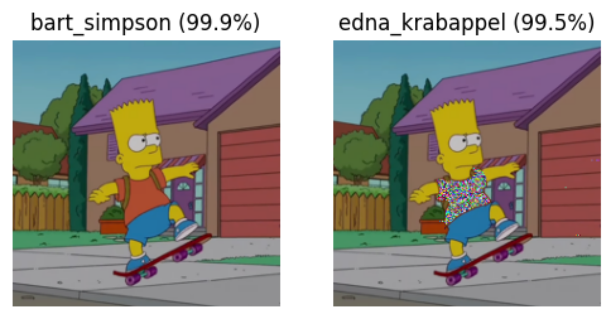
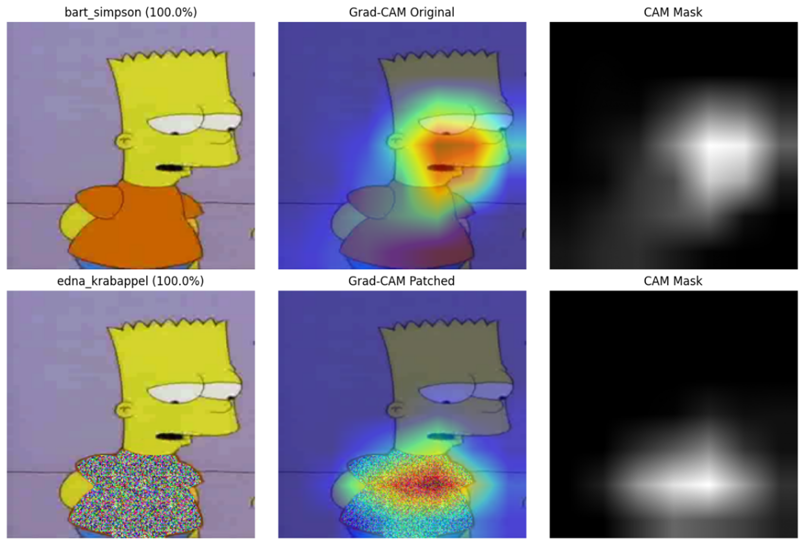
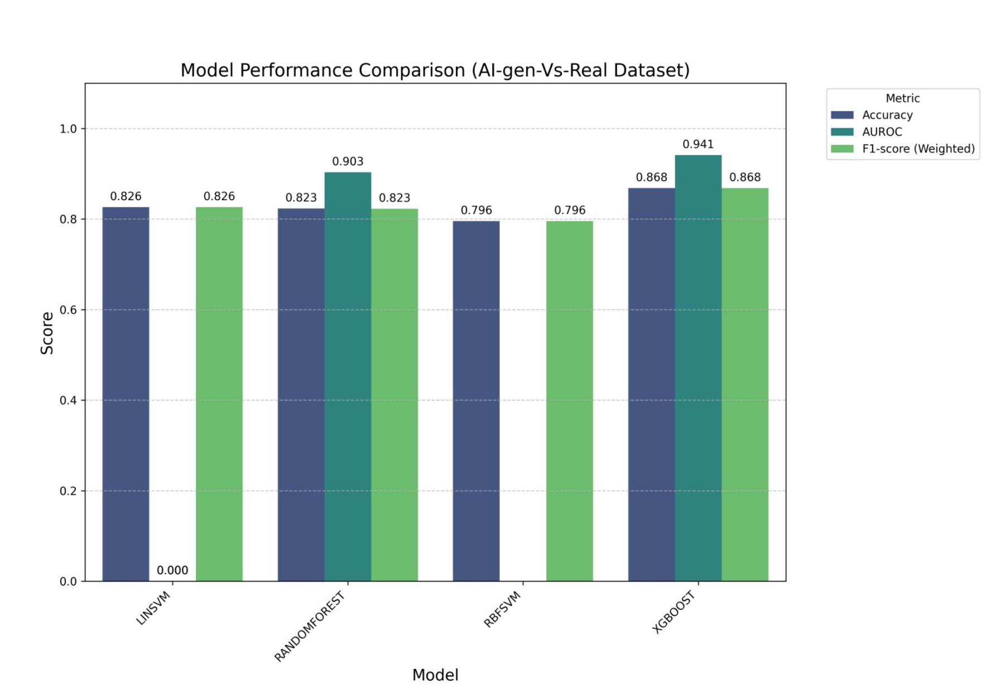
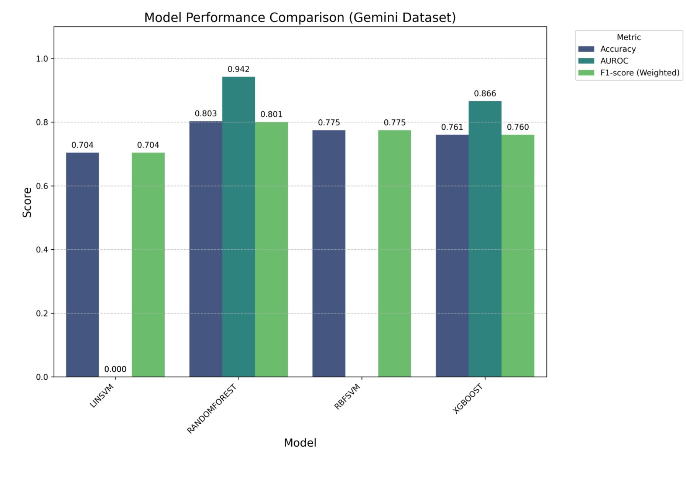
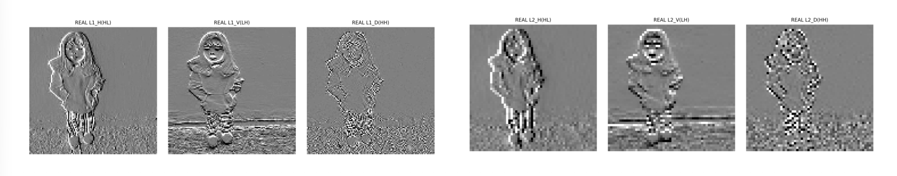

<h1 align="center">김민철 / Mincheol Kim</h1>

  중앙대학교 산업보안학과 재학 중 
  AI, AI Security, 개인정보보호에 관심을 가지고 공부하고 있습니다.

---

### About Me

- 중앙대학교 산업보안학과에서 정보보호와 보안 거버넌스를 공부하고 있습니다.
- AI 모델의 보안 문제, 특히 adversarial example과 model extraction 같은 주제에 관심이 있습니다.
- 개인정보보호와 AI 보안을 함께 이해하는 방향으로 프로젝트와 학습 내용을 정리하고 있습니다.
- 2022.11 - 2024.06 대한민국 공군 제8전투비행단 정보보호반에서 보안 운영을 경험했습니다.
  - 보안 솔루션 운영
  - NAC 로그 분석
  - 보안 인시던트 1차 대응

### Interests

- AI Security
- Adversarial Machine Learning
- Model Extraction
- Privacy & Data Protection
- Image Forensics

### Tech Stack

### Featured Projects

| Project | Status | Description | Stack |
|---|---|---|---|
| [Model Extraction Benchmark](https://github.com/caumin/model-extraction-benchmark) | In Progress | 모델 추출 공격을 통일된 실험 설정에서 비교하기 위한 PyTorch benchmark입니다. 여러 공격 계열을 같은 runtime, budget, reporting contract 아래에서 평가하는 구조를 정리하고 있습니다. PyTorch benchmark for comparing model extraction attacks under a unified experiment contract. | Python, PyTorch |
| [SafetyAI](https://github.com/caumin/safetyai) | Completed | adversarial example을 직접 실험해보기 위한 AI security 토이 프로젝트입니다. 이미지 분류 모델이 작은 입력 변화에 어떻게 흔들릴 수 있는지 확인하는 데 초점을 두었습니다. A toy AI security project for experimenting with adversarial examples. | Python, PyTorch |
| [AI-Generated Image Detector](https://github.com/caumin/deepfake-detection-sckit) | Completed | AI 생성 이미지와 실제 이미지를 구분하기 위해 통계, 주파수 도메인, 색상, 노이즈 잔여물 기반 특징을 추출하고 전통적인 ML 분류기로 학습하는 프로젝트입니다. A lightweight detector for real vs AI-generated images using statistical and frequency-domain features. | Python, scikit-learn, NumPy, Pandas |

### SafetyAI Preview

  
  

### AI-Generated Image Detector Preview

  

  

  

### Current Focus

- model extraction benchmark 구조 고도화
- adversarial ML과 AI 보안 공격/방어 기법 학습
- 개인정보보호 관점에서 AI 시스템의 위험을 이해하는 것

### Contact

- alscjf0107@cau.ac.kr

Built around security, AI, and steady learning.
